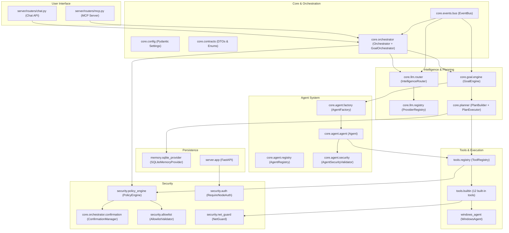

# J.A.R.V.I.S. — Architecture

## 1. Overview

JARVIS is designed as a distributed, decoupled, contract-oriented architecture, ensuring portability across hardware nodes and operating systems.

---

## 2. Module Breakdown

| Module | Responsibility | OS-Agnostic? |
|--------|---------------|--------------|
| `core/contracts` | Interfaces, DTOs, enums | Yes (100%) |
| `core/config` | Centralized settings (Pydantic) | Yes (100%) |
| `core/events` | System-wide event bus | Yes (100%) |
| `core/orchestrator` | LLM-driven agentic loop, confirmation flow | Yes (100%) |
| `core/planner` | Deterministic plan building and execution | Yes (100%) |
| `core/goal` | High-level objective lifecycle and replanning | Yes (100%) |
| `core/agent` | Agent execution, factory, registry, security | Yes (100%) |
| `core/llm` | LLM providers, routing, circuit breaker | Yes (100%) |
| `core/conversation` | Conversation context building | Yes (100%) |
| `core/mcp` | MCP server (JSON-RPC 2.0) | Yes (100%) |
| `core/task` | Task management and execution | Yes (100%) |
| `security/` | PolicyEngine, allowlist, auth, SSRF protection | Yes (100%) |
| `tools/` | Typed tool registration and execution | Yes (100%) |
| `memory/` | SQLite async persistence + audit trail | Yes (100%) |
| `server/` | FastAPI REST server and endpoints | Yes (100%) |
| `windows_agent/` | Native Windows telemetry and process management | Windows only |

---

## 3. Core Contracts

1. **`BaseTool`**: Every system action inherits from `BaseTool` with Pydantic input schema and `ToolResult` output.
2. **`ToolResult`**: Standardized output: `success: bool`, `data: Any`, `error: Optional[str]`, `execution_time_ms: float`, `security_level: SecurityLevel`.
3. **`BaseMemoryProvider`**: Async interface for key-value storage and audit entries (`AuditEntry`).
4. **`ExecutionPlan` & `TaskStep`**: Sequential, dependency-oriented task orchestration structure.
5. **`Goal`**: High-level objective with lifecycle (pending → running → completed/failed/cancelled).
6. **`AgentSpec`**: Agent specification with identity, permissions, and tool/provider allowlists.
7. **`AgentPermission`**: Immutable permission set controlling what an agent can do.

---

## 4. Security Architecture

- **PolicyEngine** classifies every tool call as GREEN (auto-execute), YELLOW (confirm), or RED (block).
- **ConfirmationManager** issues single-use, session-bound tokens for YELLOW/RED actions.
- **ToolVisibility** (`LOCAL_ONLY` / `SHARED`) prevents external LLMs from seeing local-only tools.
- **AgentSecurityValidator** enforces immutable permissions on agents — agents cannot escalate privileges.
- **NetGuard** blocks SSRF attacks: private IP blocking, DNS validation, redirect hop-by-hop checking.
- **AllowlistValidator** prevents directory traversal and validates file paths with symlink resolution.
