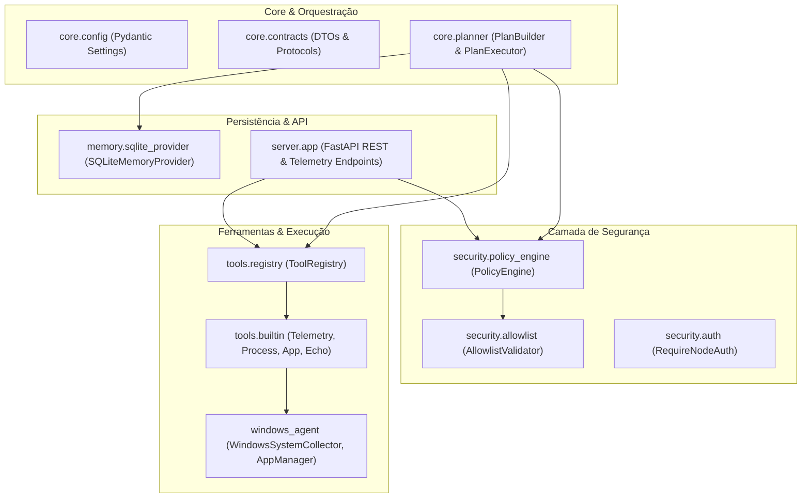

# J.A.R.V.I.S. — Arquitetura de Software

## 1. Visão Geral

O sistema **J.A.R.V.I.S.** foi projetado como uma arquitetura distribuída, desacoplada e orientada a contratos, garantindo portabilidade absoluta entre nós de hardware e sistemas operacionais.

---

## 2. Divisão Modular de Camadas

| Módulo | Responsabilidade | Agnóstico de SO? |
| :--- | :--- | :--- |
| `core/contracts` | Interfaces abstratas, DTOs e enums do sistema | Sim (100% agnóstico) |
| `core/config` | Gerenciamento centralizado de configurações e ambientes | Sim (100% agnóstico) |
| `core/planner` | Construção e execução de planos de tarefas com state machine | Sim (100% agnóstico) |
| `security/` | Validação de allowlist, controle de níveis e interceptor | Sim (100% agnóstico) |
| `tools/` | Registro dinâmico e execução tipada de ferramentas | Sim (100% agnóstico) |
| `memory/` | Persistência assíncrona SQLite e logs de auditoria | Sim (100% agnóstico) |
| `server/` | Servidor FastAPI, endpoints REST e autenticação | Sim (100% agnóstico) |
| `windows_agent/` | Coletor de telemetria nativa e processos do Windows | Específico para Windows |

---

## 3. Contratos Fundamentais

1. **`BaseTool`**: Toda ação do sistema herda de `BaseTool` e possui metadados, schema Pydantic de entrada e retorna `ToolResult`.
2. **`ToolResult`**: Saída padronizada contendo `success: bool`, `data: Any`, `error: Optional[str]`, `execution_time_ms: float` e `security_level: SecurityLevel`.
3. **`BaseMemoryProvider`**: Interface assíncrona para armazenamento chave-valor e trilhas de auditoria (`AuditEntry`).
4. **`ExecutionPlan` & `TaskStep`**: Estrutura sequencial e orientada a dependências para tarefas orquestradas.
