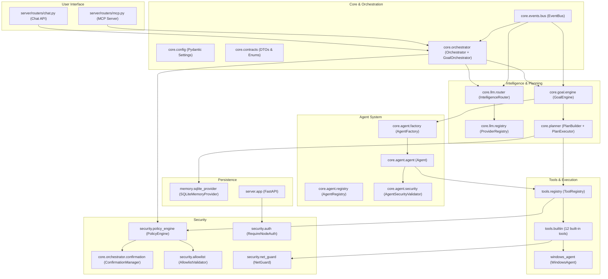

# J.A.R.V.I.S. — Architecture

## 1. Overview

JARVIS is designed as a distributed, decoupled, contract-oriented architecture, ensuring portability across hardware nodes and operating systems.

---

## 2. Module Breakdown

| Module | Responsibility | OS-Agnostic? |
|--------|---------------|--------------|
| `core/network` | CORE → SERVER bridge: RemoteNodeClient (HTTP transport only), NodePresenceManager (auto-registration + heartbeat), CentralStateClient (central conversations/memory/confirmations) | Yes (100%) |
| `server/compute.py` | SERVER gateway: compute discovery via DeviceRegistry, chat forwarding to CORE (503 without CORE) | Yes (100%) |
| `core/contracts` | Interfaces, DTOs, enums | Yes (100%) |
| `core/config` | Centralized settings (Pydantic) | Yes (100%) |
| `core/events` | System-wide event bus | Yes (100%) |
| `core/orchestrator` | LLM-driven agentic loop, confirmation flow | Yes (100%) |
| `core/planner` | Deterministic plan building and execution | Yes (100%) |
| `core/goal` | High-level objective lifecycle and replanning | Yes (100%) |
| `core/agent` | Agent execution, factory, registry, security | Yes (100%) |
| `core/llm` | LLM providers, routing, circuit breaker | Yes (100%) |
| `core/conversation` | Conversation context building | Yes (100%) |
| `core/mcp` | MCP server (JSON-RPC 2.0) | Yes (100%) |
| `core/task` | Task management and execution | Yes (100%) |
| `security/` | PolicyEngine, allowlist, auth, SSRF protection | Yes (100%) |
| `tools/` | Typed tool registration and execution | Yes (100%) |
| `memory/` | SQLite async persistence + audit trail | Yes (100%) |
| `server/` | FastAPI REST server and endpoints | Yes (100%) |
| `windows_agent/` | Native Windows telemetry and process management | Windows only |

---

## 3. Core Contracts

1. **`BaseTool`**: Every system action inherits from `BaseTool` with Pydantic input schema and `ToolResult` output.
2. **`ToolResult`**: Standardized output: `success: bool`, `data: Any`, `error: Optional[str]`, `execution_time_ms: float`, `security_level: SecurityLevel`.
3. **`BaseMemoryProvider`**: Async interface for key-value storage and audit entries (`AuditEntry`).
4. **`ExecutionPlan` & `TaskStep`**: Sequential, dependency-oriented task orchestration structure.
5. **`Goal`**: High-level objective with lifecycle (pending → running → completed/failed/cancelled).
6. **`AgentSpec`**: Agent specification with identity, permissions, and tool/provider allowlists.
7. **`AgentPermission`**: Immutable permission set controlling what an agent can do.

---

## 4. Security Architecture

### AuthorizationBoundary (Phase 10)
All tool execution flows through a single authorization boundary:
- **PolicyEngine** requires `source` parameter: `"operator"`, `"orchestrator"`, `"mcp"`, `"plan_executor"`, `"step_executor"`, `"agent"`.
- **Untrusted sources** (MCP, planner, step_executor, agent) have `confirmed=True` silently ignored.
- **RED actions** require `source="operator"` only — orchestrator and all other sources cannot confirm RED.
- **YELLOW actions** from untrusted sources always require confirmation (operator path).

### Tool Visibility
- **ToolVisibility** (`LOCAL_ONLY` / `SHARED`) prevents external LLMs and MCP from seeing local-only tools.
- MCP `tools/list` returns only SHARED tools; `tools/call` blocks LOCAL_ONLY.

### Distributed Presence (CORE → SERVER)
- On startup (FastAPI lifespan), the Core auto-registers on the SERVER via
  `POST /api/devices/` (`device_id` = `node_id`, `device_type` = `CORE`,
  `capabilities` = `["llm"]`) and sends `POST /api/devices/heartbeat`
  every `JARVIS_SERVER_HEARTBEAT_INTERVAL` seconds (default 30s).
- Registration/heartbeat run in a background task (`NodePresenceManager`);
  startup never blocks on the SERVER, and a missing SERVER only logs a
  warning — local LLM + tools keep working, retry happens next cycle.
- No inbound endpoint is invented: IP/port are announced only when
  `JARVIS_NODE_ADVERTISE_IP` / `JARVIS_NODE_ADVERTISE_PORT` are set.
- Presence is infrastructure, not an LLM tool: the LLM cannot control the
  heartbeat or change network configuration.

### Distributed Tasks (CORE intelligence, SERVER persistence)
- The Core administers task lifecycles persisted on the SERVER via
  `DistributedTaskClient` → `RemoteNodeClient` → `/api/tasks/*`
  (create, get, list, PATCH progress/status/result, cancel, pause, resume).
- Planning and LLM stay on the Core; the SERVER SQLite store is the single
  source of truth for task state. No worker, scheduler, queue, or autonomous
  execution is introduced on either side.
- Failure reports use the `errors` history (append-only semantics in the
  tasks router); there is no singular `error` column and the SQLite schema
  is unchanged.

### Cloud Fallback (Google AI Studio)
- The router chain is Ollama (priority 10, local, primary) → Google Gemini
  (priority 7, `local=False`) → mock (priority 1). The Google slot reuses
  `ExternalProvider` against the OpenAI-compatible endpoint and is registered
  only when `JARVIS_GOOGLE_API_KEY` + `JARVIS_GOOGLE_BASE_URL` are set.
- Non-local providers only ever receive SHARED tools (see Tool Visibility).
- `ExternalProvider.generate()` retries transient HTTP 408/429/500/502/503/504
  (3 attempts, ~1s/~2s `asyncio.sleep` backoff); permanent 4xx never retry;
  failures surface as `LLMResponse(error_msg=...)` so the router falls through.
  Streaming has no retry in this stage.

### Streaming (Fase 11)
- `Orchestrator.stream_message()` espelha o agentic loop do `process_message` emitindo `OrchestratorStreamEvent` (`START`, `THINKING`, `TEXT_DELTA`, `TOOL_CALL`, `TOOL_RESULT`, `WAITING_CONFIRMATION`, `ERROR`, `DONE` — SSE usa o nome em minúsculas).
- Seleção/fallback de provider continuam em `route_stream()`/`generate_stream()` (sem duplicação); tool calls passam pelos mesmos `PolicyEngine`/`ToolExecutor`/`ConfirmationManager` e pela mesma persistência (sequência OpenAI-compatible preservada).
- Tool calls em stream são buffered e mesclados por id — nunca tratados como parciais; texto flui delta a delta sem acumular a resposta em memória.
- `POST /api/chat/stream` entrega `text/event-stream` (`event:` + `data: JSON` + `\n\n`) com a mesma autenticação do `/send`, que permanece inalterado.

### Central Server & Central State Authority (Fase 12)

SERVER = control plane / source of truth (gateway FastAPI + SQLite central).
CORE = compute plane (Orchestrator, Ollama/Qwen, Gemini fallback, local tools,
Windows Agent) e consome estado central via HTTP. O SQLite local do Core só é
fonte de verdade com central state desabilitado (padrão em testes/dev).

- **Conversa central**: `POST/GET /api/conversations[/{id}[/messages]]` sobre o
  schema existente; `ConversationManager` aceita backend central
  (`JARVIS_CENTRAL_STATE_ENABLED`, `JARVIS_CENTRAL_STATE_REQUIRED` para falhar
  explicitamente em vez de cair para o SQLite local).
- **Memória central**: `CentralMemoryProvider` (mesma interface
  `BaseMemoryProvider` + `search_memory`); `search_memory` usa o backend do
  runtime. SQLite continua sendo a primeira camada; sem vetores.
- **Confirmações centrais**: tabela `confirmations` + `/api/confirmations/*`
  (create/resolve/consume atômico single-use/pending/cleanup); single-use,
  session binding, expiry, approved/denied e `remaining_calls` preservados.
- **Gateway**: com `node_role=SERVER`, `POST /api/chat/send|/stream` encaminha
  a um CORE elegível (type CORE + capability LLM + ONLINE/READY + ip/porta via
  `DeviceRegistry`); sem CORE → HTTP 503 explícito, nunca resposta inventada.
- **Compute interno**: `POST /internal/chat/send|/stream` (auth obrigatória,
  recusado em role SERVER) reutiliza exatamente o Orchestrator; proxy SSE
  byte a byte, sem tarefas órfãs. LLM pesado nunca roda no SERVER.

### Other Security Components
- **ConfirmationManager** issues single-use, session-bound tokens for YELLOW/RED actions with timestamps, expiry, and reuse blocking.
- **AgentSecurityValidator** enforces immutable permissions on agents — agents cannot escalate privileges.
- **AgentToolExecutor** validates permissions at execution time for every tool call.
- **NetGuard** blocks SSRF attacks: private IP blocking, cloud metadata IPs (`169.254.169.254`, `169.254.169.253`), DNS validation, redirect hop-by-hop checking, `metadata.google.internal` hostname blocking.
- **AllowlistValidator** prevents directory traversal and validates file paths with symlink resolution.
- **CORS** configured via `JARVIS_CORS_ORIGINS` env var; production defaults to same-origin only.
